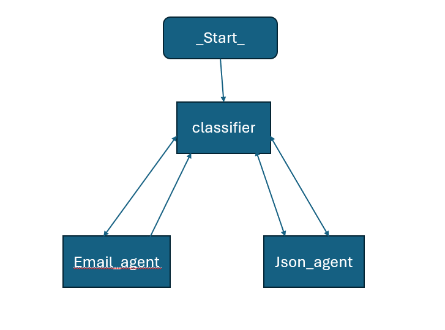
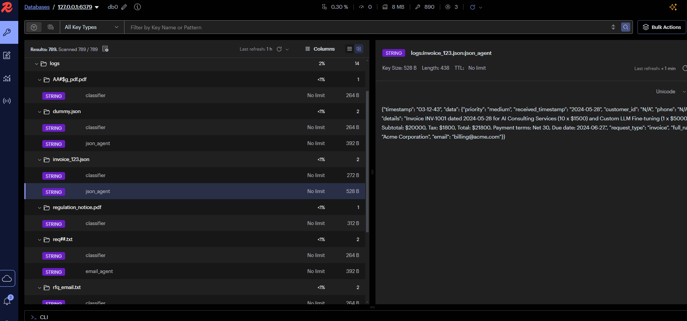

# Multi-Agent Input Router

A multi-agent AI system that accepts inputs in PDF, JSON, or Email formats, automatically classifies both the format and the intent, and routes them to specialized agents for downstream processing.

> The system maintains shared context (e.g., sender, topic, last extracted fields) via memory implimentations using redis to enable chaining and traceability.

## What It Does

This system is composed of three core agents, orchestrated via a central Classifier Agent, and powered by a robust Redis-based shared memory module for context-aware processing.

### Agent Overview

#### 1. Classifier Agent
- Accepts raw inputs: PDF, JSON, or plain-text Email
- Classifies:
  - Format: PDF / JSON / Email
  - Intent: Invoice, RFQ, Complaint, Regulation, etc.
- Handles routing to appropriate agents
- Logs format and intent to shared memory for traceability

#### 2. Email Agent
- Processes unstructured email inputs
- Extracts:
  - Sender Info
  - Intent
  - Urgency
  - Received_timestamp
  - Subject 
- Converts to CRM-style structured format
- Updates shared Redis memory to support chained workflows

#### 3. JSON Agent
- Accepts structured JSON payloads
- Extracts data and reformats it to a target schema
  "customer_id": string,
  "full_name": string,
  "email": string,
  "phone": string,
  "request_type": one of ["invoice", "complaint", "rfq", "regulation", "other"],
  "details": string,
  "priority": one of ["low", "medium", "high"],
  "received_timestamp": string
  "anomalies": string
- Flags:
  - Missing fields
  - Field mismatches or anomalies
- Writes outputs and anomalies to shared context

## Shared Memory Module (Redis)

All agents interact with a central Redis store that:
- Tracks the source, type, timestamp
- Stores extracted fields
- Maintains a conversation or thread ID
- Ensures all agents remain context-aware throughout execution

Logs are stored under Redis keys like:
```
log:<file_id>:classifier: {logged_content}
log:<file_id>:email_agent: {logged_content}
log:<file_id>:json_agent: {logged_content}
```

## Setup Instructions

### 1. Clone and Prepare
```
git clone https://github.com/<your-username>/multi-agent-input-router.git
cd multi-agent-input-router
```

### 2. Create `.env` File
Inside the root directory, create a `.env` file and add:
```
GOOGLE_API_KEY=your_gemini_api_key
LANGCHAIN_API_KEY=your_langsmith_api_key
```

### 3. Install Dependencies
```
pip install -r requirements.txt
```

### 4. Start Redis (Via Docker)
```
docker run -d -p 6789:6379 --name redis-server redis
```

Redis will run on `localhost:6789` and serve as the shared memory backend for all agents.

### 5. Add Files
Place all your input files (`.json`, `.pdf`, `.txt`) into the `dummy_dir/` folder.

### 6. Run the Agent System
```
python agent.py
```

## Optional: LangSmith Tracing

LangSmith allows deep tracing and debugging of agent flows.

### Setup:
- Go to https://smith.langchain.com/
- Get your tracing API key
- Add to your `.env`:
```
LANGCHAIN_API_KEY=your_langsmith_api_key
LANGCHAIN_PROJECT=multi-agent-router
LANGCHAIN_TRACING_V2=true
```

## Sample Output Logs

Logs are automatically stored in Redis and organized per file. Each file gets its own set of logs under subkeys:
```
log:<filename>:classifier
log:<filename>:email_agent
log:<filename>:json_agent
```

You can view logs manually using:
```
import redis, json

r = redis.Redis(host='localhost', port=6789, decode_responses=True)
logs = r.lrange("log_list", 0, -1)
for log in logs:
    print(json.loads(log))
```

## System Architecture



## Logs Screenshot

Here’s a sample of how Redis logs look per file:



## Project Structure

```
multi-agent-input-router/
├── dummy_dir/           # Input files directory
├── agent.py             # Main entrypoint
├── prompts.py 
├── tools_custom.py 
├── tools_utils.py
├── requirements.txt
├── .env
└── README.md
```

## Acknowledgements

- OpenAI & Gemini for LLM APIs
- Redis for fast in-memory data storage
- LangSmith for powerful tracing and visualization

## Questions or Contributions?

Feel free to open issues or pull requests.
